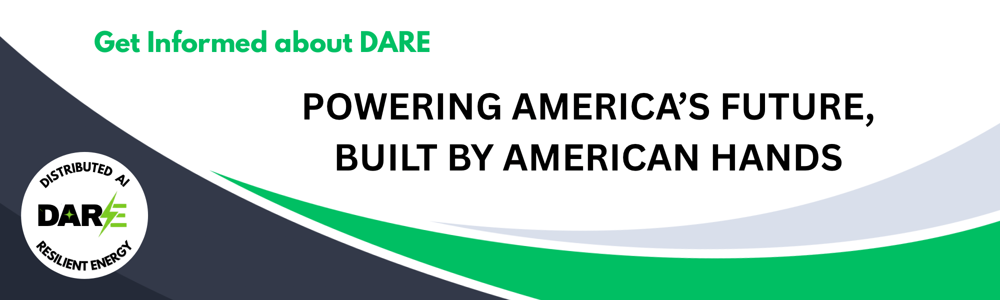

## DARE: Powering America's Future, Built by American Hands

### Headline: "America's Next Tech Boom: Built Here, Powered for Good!"

Imagine a future where America is undeniably first in AI, where our tech boom creates millions of jobs, and our communities thrive on cutting-edge innovation. Right now, the secret to that future needs massive power – 51 gigawatts by 2027 – a demand so huge it could hold us back.

But we have the solution: **DARE (Distributed AI Resilient Energy)**.

DARE isn't just a project; it's a bold vision to **repower America's AI future using the very heart of American manufacturing: the engines from our iconic automakers like Ford, GM, Dodge, and Tesla.**

We're talking about smart, modular data centers – basically, powerful AI hubs – that can be rapidly deployed anywhere along our existing natural gas pipelines. These aren't just efficient; they're incredibly resilient, ensuring our AI backbone is always on, always strong.

---

### Why DARE is America's Moment:

* **Massive Savings, Big Impact:** We're talking about powering this AI revolution for a fraction of the traditional cost – saving billions. This means more resources for innovation, more investment back into our communities.
* **Lightning-Fast Deployment:** Forget waiting years for power plants. DARE's modular system lets us deploy new energy in just **2-3 years**, keeping America ahead of the curve, especially against global competitors.
* **Unbreakable & Efficient:** With built-in redundancy, DARE units are designed to be incredibly reliable. Plus, by placing computing power closer to where it's needed, we cut waste and make the whole system stronger and more efficient.
* **Jobs & Economic Growth:** This isn't just about electricity; it's about igniting a **new, vital American industry**. We're talking high-paying jobs in manufacturing, installation, and maintenance, transforming our automotive industrial base into a strategic asset for the AI era and fueling robust American growth.

This is our chance to turn a monumental challenge into a monumental triumph. To **"Make America Compute Again"** by unleashing American ingenuity.

---

### A Call to Action for Every American:

**For Leaders & Innovators:** This is your moment to champion an open-source standard for these power modules, unleashing a wave of American-made innovation. Rally our iconic automakers to embrace this future.

**For Lawmakers & Communities:** Let's clear the path for rapid deployment, ensuring our nation remains at the forefront of the AI revolution.

**This is a grassroots movement to power our future, built by American hands, securing our prosperity and national security for generations.** The jobs and economic triumphs this vision delivers will speak volumes.

---

This is currently a collaboration between humans and (several) AI(s) for analysis, research, and copy-writing.

### About me: 
Its not about me. Its about America. I'm just the retired High-Tech guy whose brain won't shut off. I enjoy technology, cars, and solving problems. Oh, and travel and fishing. I am an inventor, and have read many open-source specifications and know they are a powerful tool for aligning industry change. I am looking forward to American leadership in this next tech boom!

### Learn More:

* **Dive Deeper into the Project Details:** [Detailed Introduction to DARE](DARE_Intro.md)
* **This Intro and "Call to Action" summary:** [Grassroots](README.md)
* **FAQ:** [FAQ](FAQ.md)
  
